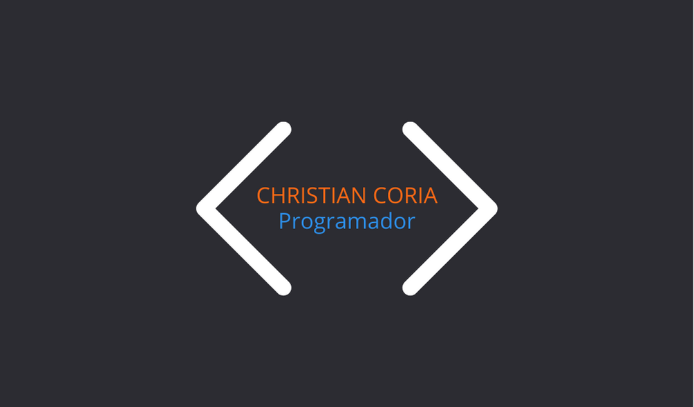
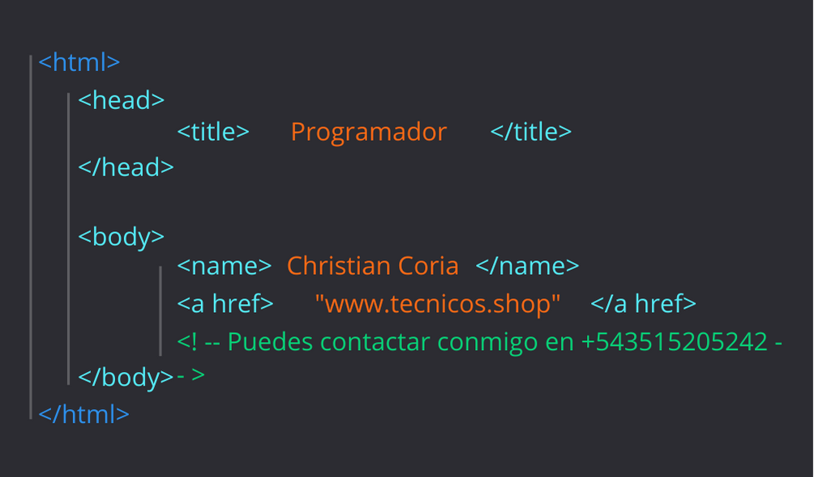
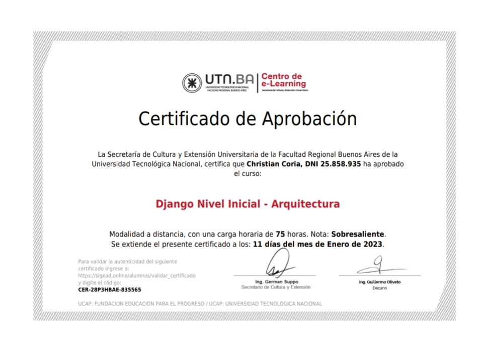
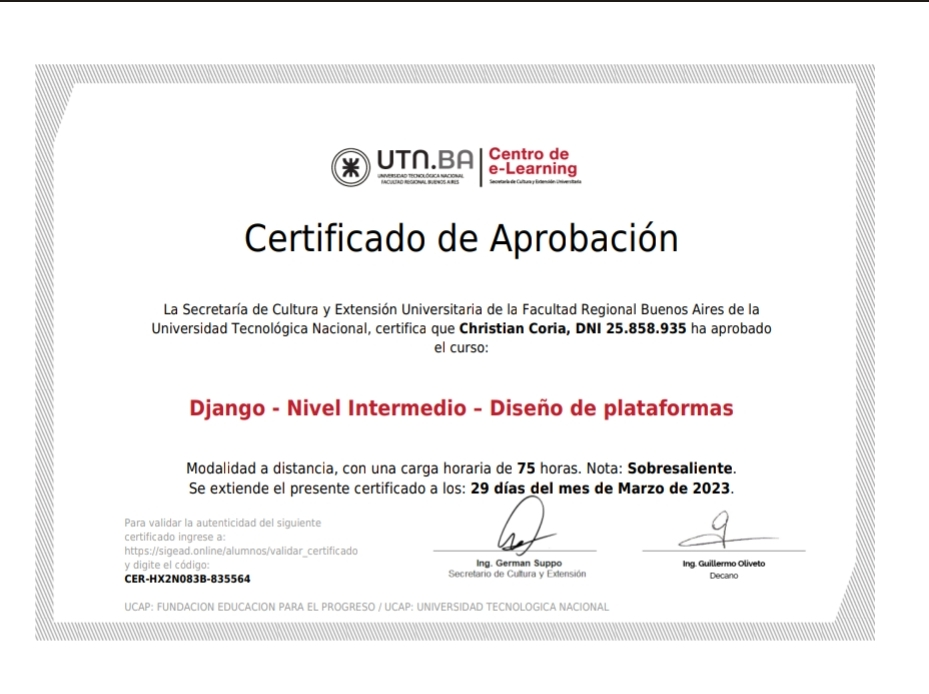
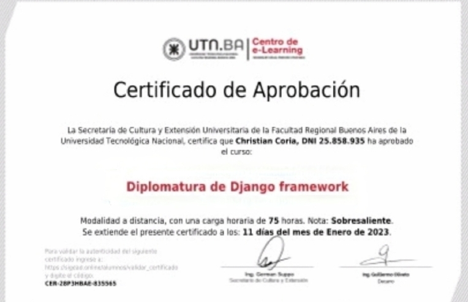
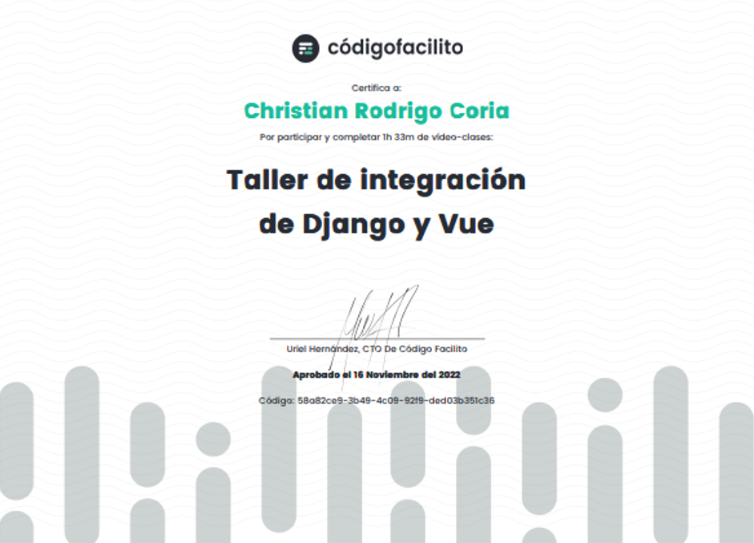
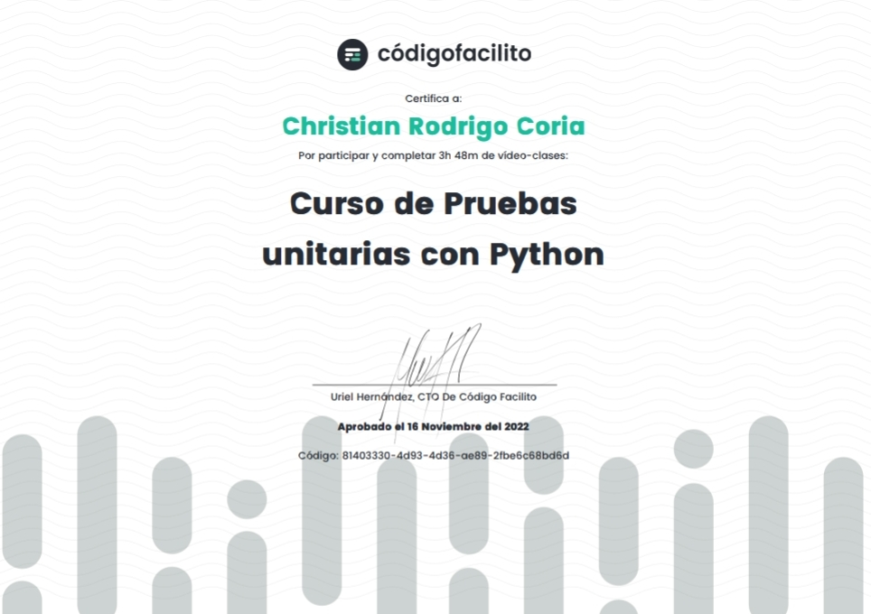
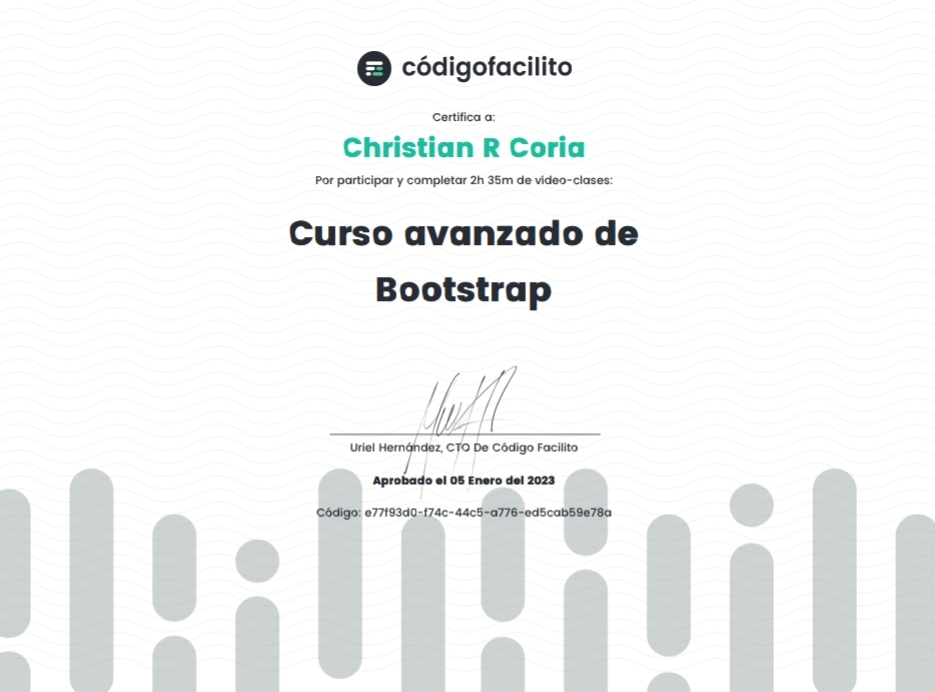
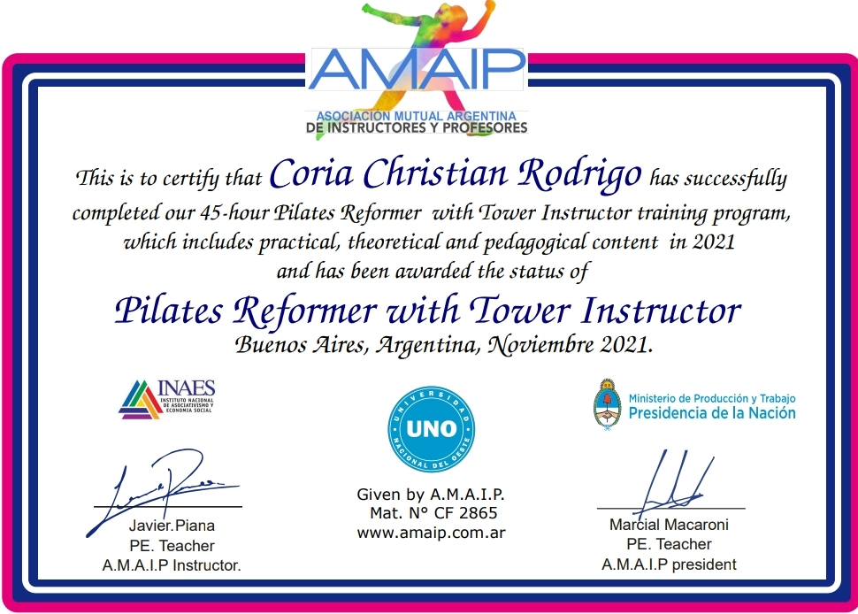

### Hi there 👋 

## 🌍 Estudio Programacion en Python :

  
**Christian-Coria/Christian-Coria** is a ✨ _special_ ✨ 

- This is my Main Project:
  [==> Tecnicos.shop <==](https://tecnicos.shop)

Here are some ideas to get you started:

- 🔭 I’m currently working on EnLInea.com 
- 🌱 I’m currently learning Programing PYTHON
- 😄I studied and graduated from CODER HOUSE as a PROGRAMMER in PYTHON being the First of My Class and thus accessing the top 10 of coder.  
- 👨‍💻 Currently studying the technique of the 'POLYTECHNIC INSTITUTE OF CORDOBA' (ISPC) ON        INNOVATION OF TECHNOLOGIES 4.0 Where we also study, among other subjects, Programming in PYTHON.

- 😁 Hola, soy Christian Rodrigo Coria, y mi historia en el mundo de la tecnología y los negocios es fascinante. Mi carrera comenzó en 1998 cuando entré como vendedor en el emocionante mundo de la telefonía móvil. En tan solo tres meses, mi dedicación y pasión me llevaron a la oportunidad de dirigir mi primera subagencia de CTI Móvil. Durante dos años, lideré esta subagencia con éxito, adquiriendo habilidades valiosas en ventas y gestión.

En el 2001, di un gran paso y me uní a Telecom Personal como parte afiliada a 'Primer S.A.'. Aquí, como subagente oficial de Personal, continué mi ascenso en la industria de las telecomunicaciones. Mi compromiso y conocimiento me permitieron destacarme en la gestión de clientes minoristas y establecer relaciones sólidas en el negocio.

Mi espíritu emprendedor me impulsó en 2004 a independizarme de los agentes y abrir mi propio local de telefonía celular. Desde entonces, he sido dueño y operador de negocios exitosos en ventas y servicios de telefonía móvil. Mi experiencia en la industria me ha convertido en un experto en hardware y software, y he brindado soluciones a clientes y empresas de manera constante.

En 2019, decidí explorar el mundo de la programación de manera independiente. Este nuevo desafío me llevó a profundizar mis habilidades técnicas y expandir mi conocimiento. Mi pasión por la tecnología me llevó a unirme a CoderHouse en 2021, donde me gradué como programador en Python 👨‍🎓. A partir de ahí, continué mi aprendizaje con una variedad de cursos en diferentes plataformas, ampliando mis horizontes en el mundo de la programación y el desarrollo web.
En 2022, di un paso significativo al inscribirme en la Universidad Tecnológica de Buenos Aires, donde completé una "Diplomatura en Django" en agosto de 2023 👨‍🎓. Mi formación académica en desarrollo web se sumó a mis habilidades empresariales y técnicas, creando un conjunto único de conocimientos y competencias que me permiten abordar desafíos tecnológicos de manera integral.

Me enorgullece mi trayectoria como vendedor, comerciante, dueño de negocios, empleador, estudiante y técnico en telefonía celular. En 2022, además de mi carrera en tecnología, completé mis estudios de Pilates Reformer y me convertí en instructor certificado en esta disciplina 🤸‍♂️. Estas experiencias me han dado una perspectiva única y la capacidad de ofrecer soluciones efectivas a los desafíos tecnológicos y de bienestar. Estoy emocionado 😀 por seguir creciendo y explorando nuevas oportunidades en el emocionante mundo de la tecnología, la programación y la salud y bienestar. 👍

- Este es mi Proyecto principal:
  [==> Tecnicos.shop <==](https://tecnicos.shop)

 

 

 

 

 

 

 

 

 

 

 

 

 

 

 
