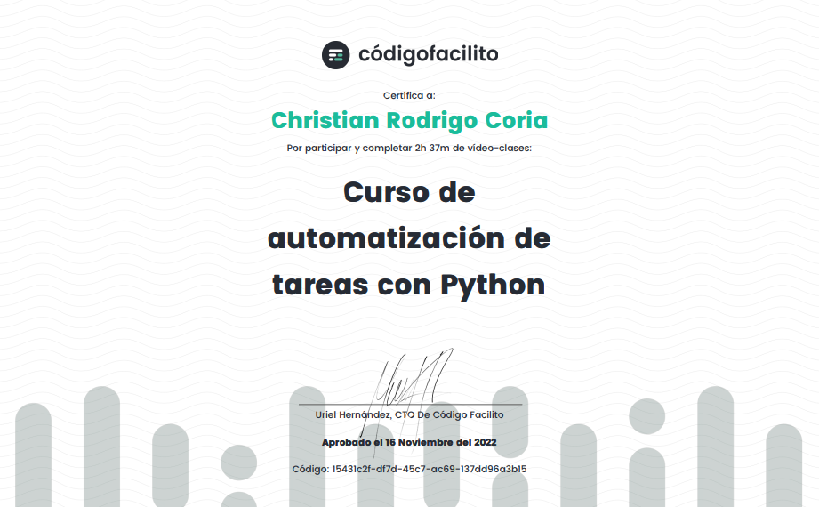

### Hi there 👋 

## 🌍 Estudio Programacion en Python :

  
**Christian-Coria/Christian-Coria** is a ✨ _special_ ✨ 

Here are some ideas to get you started:

- 🔭 I’m currently working on EnLInea.com 
- 🌱 I’m currently learning Programing PYTHON
- 😄I studied and graduated from CODER HOUSE as a PROGRAMMER in PYTHON being the First of My Class and thus accessing the top 10 of coder.  
- 👨‍💻 Currently studying the technique of the 'POLYTECHNIC INSTITUTE OF CORDOBA' (ISPC) ON        INNOVATION OF TECHNOLOGIES 4.0 Where we also study, among other subjects, Programming in PYTHON.

 

 

 

 

 

 

 

 

